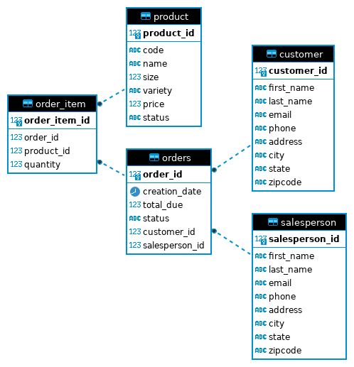

# Introduction
In this project, I am utilizing the Java Database Connectivity (JDBC) API to proficiently read and manage data from diverse relational databases, including Postgres, Oracle Database, MySQL, and SQL Server. Through this hands-on experience, I am gaining the expertise to seamlessly integrate the JDBC API into Java applications, enabling me to interact with and manipulate data in these databases smoothly. To complete this project, I am utilizing the following tools and technologies: IntelliJ IDE for Java development, Docker for containerization, PostgreSQL as the database management system, and the psql CLI tool for interacting with PostgreSQL from the command line. This combination of tools allows me to efficiently develop, test, and deploy my database solutions, ensuring a successful and efficient project completion.

# Implementaiton
## ER Diagram

## Design Patterns
Discuss DAO and Repository design patterns (150-200 words)

# Test
How you test your app against the database? (e.g. database setup, test data set up, query result)
