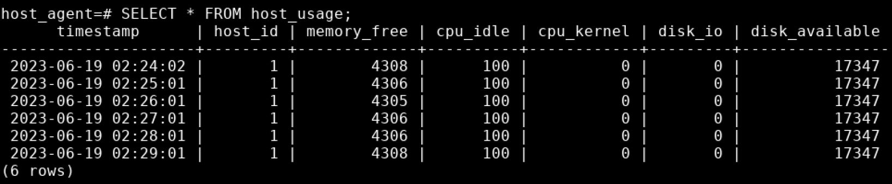

# Linux Cluster Monitoring Agent

## Table of Contents

- [Introduction](#Introduction)
- [Installation](#Installation)
- [Quick Start](#QuickStart)
- [Implemenation](#Implemenation)
- [Improvements](#Improvements)

## Introduction
In Jarvis, the Linux Cluster Administration (LCA) team is responsible for managing a cluster of 10 servers. These servers are internally connected through a switch and communicate with each other using internal IPv4 addresses. The LCA team collects hardware and usage information from each server to ensure smooth operation and maintenance.

The goal of this project is to provide an efficient and user-friendly solution for monitoring the hardware and usage information of each server from the perspective of server users. The majority of the application is implemented using bash scripts, which allow for easy execution and integration with existing server management workflows.

To store the collected hardware and usage information, a Rational Database Management System is employed, with PostgreSQL (psql) as the chosen database technology. This ensures reliable and scalable data storage and management for the LCA team.

To facilitate deployment and isolation, this project is implemented under a Docker container. Docker provides a lightweight and portable environment, enabling consistent execution across different server setups and minimizing compatibility issues.

The development progress of this project is tracked using Git version control. Regular updates and improvements are uploaded to a Git repository, allowing for collaboration and easy access to the latest features and bug fixes.

By monitoring hardware and usage information through this project, server users can gain valuable insights into the performance and health of their servers. This information empowers the LCA team to proactively address any issues, optimize resource allocation, and ensure the overall stability and efficiency of the server cluster.

## Installation 
The installation of this application can be done by executing the following commands:
```shell script
https://github.com/Jarvis-Consulting-Group/jarvis_data_eng-Derek430.git
cd your-repo/linux_sql
```
### Dependencies
- docker: version 24.0.2
- crontab: crontabs-1.11-6.20121102git.el7.noarch

  
## Quick Start
### 1. Create/Start/Stop a psql instance based on the 'postgres:9.6-alpine' image using psql_docker.sh.
  #### To create a psql instance with port number
```shell script
./scripts/psql_docker.sh create [db_username][db_password]
```

 #### To start a psql instance that is already created
```shell script
./scripts/psql_docker.sh start 
```

 #### To stop a psql instance that is already created
```shell script
./scripts/psql_docker.sh stop 
```

### 2. Create a Database named 'host_agent' which includes two tables: 'host_info' and 'host_usage' using psqldbuild.sql.
```shell script
./sql/psqldbuild.sh
```

### 3. Insert hardware specs data into the DB using host_info.sh.
```shell script
./script/host_info.sh "host_agent" 5432 "host_info" "postgres" "password"
```

### 4. Insert hardware usage data into the DB using host_usage.sh.
```shell script
./script/host_usage.sh "host_agent" 5432 "host_info" "postgres" "password"
```

### 5. Setup Cron job
```shell script
./script/cronjob.sh
```

## Implemenation
Discuss how you implement the project.
### Architecture


### Scripts
- **psql_docker.sh**
  The psql_docker.sh script provides a convenient way to create, start, and stop a Docker container running the PostgreSQL database server. The script is specifically designed to use the "postgres:9.6-alpine" Docker image.By executing the script with the 
  appropriate parameters, you can easily set up and manage a PostgreSQL container for your Linux monitoring project. The script allows you to specify the username and password to be used for accessing the database within the container.
  #### Usage 
  To use the psql_docker.sh script, please ensure that Docker is installed and running on your system. Open a terminal or shell environment. Open the script in a text editor and review the configurable variables. The Docker image used is set as "postgres:9.6-alpine". The CONTAINER_NAME variable is pre-set as "linux-monitor", but you can change it if desired. If necessary, set the execution permissions for the script. If the permissions are not already set, 
  you can use the chmod command. For example:
     ```shell script
      chmod +x psql_docker.sh
     ```
  Execute the script with the desired parameters. For example, to create a Docker container with the username "myusername" and password "mypassword", use the following command:
     ```shell script
      ./scripts/psql_docker.sh create [db_username][db_password]  
     ```
  
- **psqldbuild.sh**
 The psqlbuild.sh script is used to create a PostgreSQL database named 'host_agent' and set up two tables within it: 'host_info' and 'host_usage'. This script facilitates the initialization and configuration of the database schema required for the Linux     
  monitoring project.By executing the script, you can easily create the necessary database and tables for storing host information and usage data.
  
  #### Usage 
     Execute the script to create the 'host_agent' database and the required tables. Use the following command:
     ```shell script
      chmod +x psqlbuild.sh
      ./scripts/psqlbuild.sh
     ```
     
- **host_info.sh**
  The host_info script is used to insert hardware information into the created 'host_info' table. Caution: This script only needs to be executed once on each server.
  
  #### Usage 
   Execute the script by using the following command:
   ```shell script
      chmod +x host_info.sh
      ./scripts/host_info.sh
    ```
  
- **host_usage.sh**
  The host_usage script is used to insert hardware usage information into the created 'host_usage' table.
  
  #### Usage 
   Execute the script by using the following command:
   ```shell script
      chmod +x host_usage.sh
      ./scripts/host_usage.sh
    ```
  
- **crontabjob.sh**
  The crontabjob.sh script is used to add the "host_usage.sh" script to a cron job, enabling it to execute once per minute.
  
  #### Usage 
   Execute the script by using the following command:
   ```shell script
      chmod +x crontabjob.sh
      ./scripts/crontabjob.sh
    ```
  

## Database Modeling
Describe the schema of each table using markdown table syntax (do not put any sql code)

### host_info Table

| Column Name  | Data Type | Description                           |
|--------------|-----------|---------------------------------------|
| id           | SERIAL    | Unique identifier for the host         |
| hostname     | VARCHAR   | Hostname of the machine                |
| cpu_number   | INTEGER   | Number of CPUs in the host             |
| cpu_architecture | VARCHAR | Architecture of the CPU                |
| cpu_model    | VARCHAR   | Model information of the CPU           |
| cpu_mhz      | FLOAT      | Speed of the CPU in mHz                |
| L2_cache     | INTEGER   | Size of the Level 2 cache in KB         |
| total_mem    | INTEGER   | Total memory in the host in KB          |
| timestamp    | TIMESTAMP | Timestamp of when the data was recorded|

#### host_usage Table

| Column Name  | Data Type | Description                           |
|--------------|-----------|---------------------------------------|
| timestamp    | TIMESTAMP | Timestamp of when the data was recorded|
| host_id      | INTEGER   | Foreign key referencing host_info table|
| memory_free  | INTEGER   | Free memory in the host in MB           |
| cpu_idle     | INTEGER      | Percentage of CPU idle time            |
| cpu_kernel   | INTEGER      | Percentage of CPU kernel time          |
| disk_io      | INTEGER   | Number of disk I/O operations          |
| disk_available | INTEGER  | Available disk space in MB           |

# Test
After going though all steps in Quick Start, the final results from host_usage table should look like:


# Improvements
- Only execute the host_usage.sh script only when new processing exists. 
- Display the host spec and host usage data on visulization tool.

